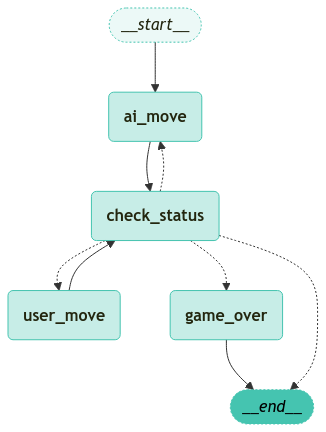

## 📅 2025-01-29 - Daily Learning Log

### 📝 What I Learned Today
- 프롬프트 템플릿 만들기
- yaml에 템플릿 따로 작성할 수 있음
- 대충 알아서는 코파일럿도 코드 안만들어줌

---
### 🔗 References
1. [Prompt Template](https://wikidocs.net/252230)

---
### 💻 Example Code 
#### prompt template example code
[prompt_template.ipynb](./prompt_template.ipynb)

#### Modified the LangGraph structure for a chess chatbot (incomplete, not functioning as desired)
[My_chess_page.py](./My_chess_page.py)



#### To run the code with Streamlit
```sh
streamlit run My_chess_page.py
```
press ctrl+c to kill the terminal. 

---
### 🤔 Considerations
대충 흐름만 이해하고도 chatGPT와 copilot으로 코드를 완성할 수 있을 줄 알았는데 아니었음 잘안됨. 
결국 공식 문서를 차근차근 읽어보기로 함.

---
### 🏆 Next Steps
[LangChain Documents](https://langchain-ai.github.io/langgraph/concepts/low_level/?h=reducer#why-use-messages)
- 차근차근 읽고 정리하기